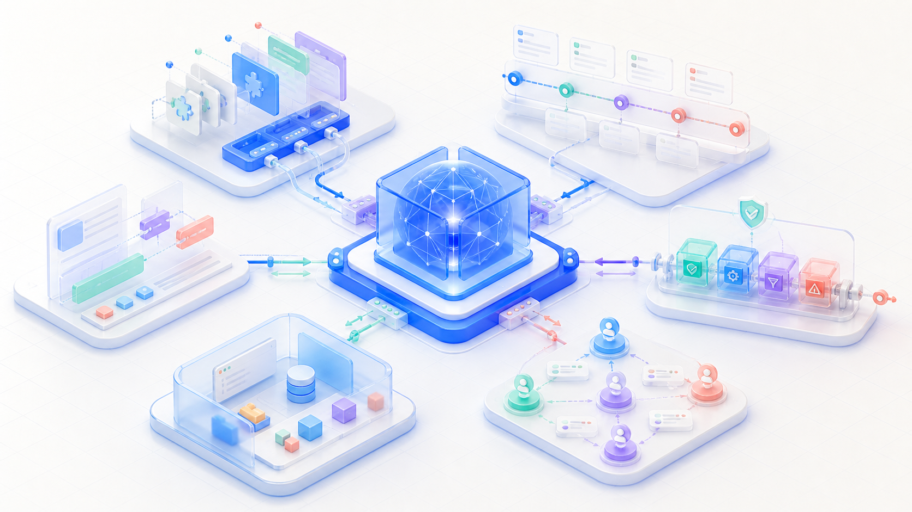
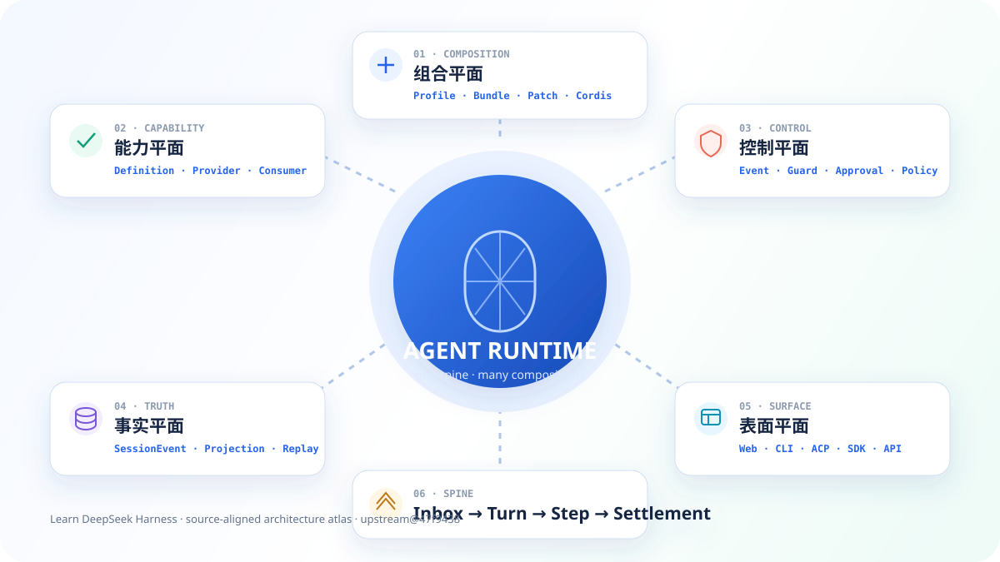
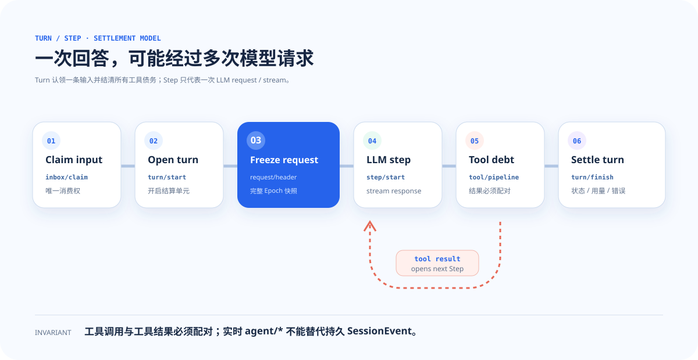
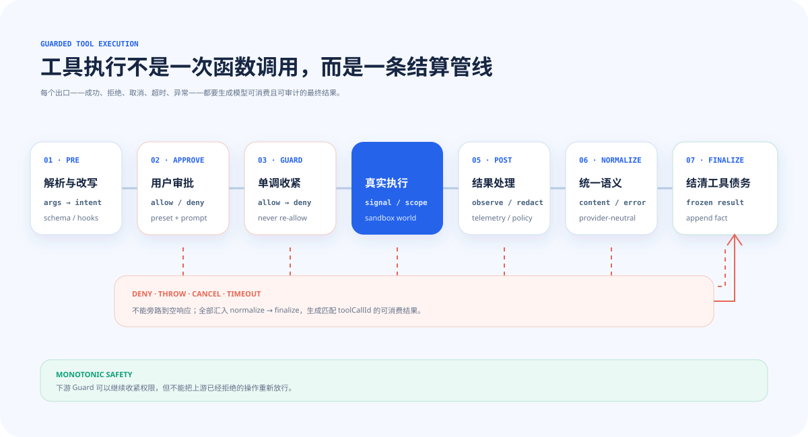

<div align="center">



# Learn DeepSeek Harness

### Turn a complex agent runtime into transferable architecture skill.

**28 deep chapters · 6-layer learning ramp · 70 static pages · bilingual · source-aligned mechanisms**

[Live course](https://learn-deepseek-harness.vercel.app/en) · [简体中文](README.md) · [Architecture atlas](https://learn-deepseek-harness.vercel.app/en/architecture) · [Source index](https://learn-deepseek-harness.vercel.app/en/docs)

</div>

## What this project does differently

[DeepSeek Harness](https://github.com/deepseek-ai/deepseek-harness) turns model calls into controlled, recoverable, replayable, and composable agent behavior. Its central idea—**Everything is a Plugin**—is powerful, but the real design is easy to lose behind framework vocabulary.

This independent learning companion starts with an accurate intuition, traces the real mechanism, names invariants and failure modes, then anchors every conclusion in upstream source. Every chapter includes an interactive flow, a knowledge check, and an explicit bridge to the next concept.

> The curriculum is pinned to upstream commit [`47f9438`](https://github.com/deepseek-ai/deepseek-harness/commit/47f943859bef60e4160492346772ded9b24f765a) from 2026-08-13: 49 top-level package families, 324 documentation files, and 3,746 package files. DeepSeek Harness remains a developer preview; upstream is authoritative.



## The six-layer curriculum

| Layer | Chapters | Outcome |
|---|---|---|
| 01 · Mental model | H01–H04 | Explain model, agent, and harness boundaries; navigate a large source tree |
| 02 · Composition grammar | H05–H09 | Read Context, Effect, Fiber, Service, Event, Scope, Profile, and Bundle |
| 03 · Agent spine | H10–H15 | Trace Agent, Session, Turn, Step, Prompt, LLM, and Tool event by event |
| 04 · Safety and durability | H16–H20 | Reason about denial, crashes, cancellation, long context, and replay |
| 05 · Collaborative systems | H21–H24 | Separate goals, subagents, jobs, workflows, schedules, and discovery |
| 06 · Build and ship | H25–H28 | Build tools and providers, connect surfaces, and ship profiles and bundles |

## Two mechanisms worth tracing



A turn is work that must settle; a step is one model request. Tool calls create debt that must return as paired results before the turn can close.



Real tool execution is a pipeline: `pre → approval → guard → around → post → normalize → finalize`. Success, denial, exceptions, cancellation, and timeouts all converge on a model-consumable, auditable result.

## Run locally

```bash
git clone https://github.com/xxiaoxiong/learn-deepseek-harness.git
cd learn-deepseek-harness/web
npm install
npm run dev
```

Open [http://localhost:3000/en](http://localhost:3000/en). Quality gates:

```bash
npm run lint
npm run build
```

## Safety and status

Files under `snippets/` are mechanism-revealing teaching slices, not production agent code. They intentionally omit full approval, sandboxing, isolation, credential policy, and recovery. Never execute untrusted input or use production credentials in them.

The teaching structure is deeply inspired by [learn-hermes-agent](https://github.com/xxiaoxiong/learn-hermes-agent). Research, DeepSeek Harness curriculum, interactive flows, diagrams, and the bright visual system were designed specifically for this project.

## License

[MIT](LICENSE) © 2026 [xxiaoxiong](https://github.com/xxiaoxiong)
