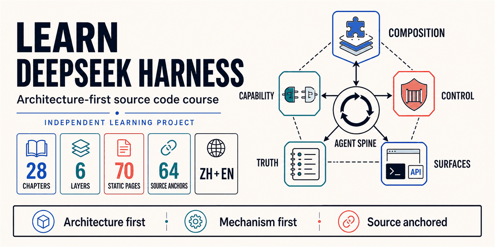

<div align="center">



# Learn DeepSeek Harness

### 面向开发者的 DeepSeek Harness 架构与源码深度课程

把复杂的 **AI Agent runtime、Cordis 插件系统、工具执行管线与可恢复运行机制**，读成一套能迁移到自己项目中的架构能力。

**28 章深度课程 · 6 层认知坡道 · 70 个静态页面 · 64 个源码锚点 · 中英双语**

[](https://learn-deepseek-harness.vercel.app/zh)
[](https://github.com/deepseek-ai/deepseek-harness/commit/47f943859bef60e4160492346772ded9b24f765a)
[](https://learn-deepseek-harness.vercel.app/zh/timeline)
[](LICENSE)

[开始第一章](https://learn-deepseek-harness.vercel.app/zh/chapter/h01-harness) · [架构图谱](https://learn-deepseek-harness.vercel.app/zh/architecture) · [设计对比](https://learn-deepseek-harness.vercel.app/zh/compare) · [学习路径](https://learn-deepseek-harness.vercel.app/zh/timeline) · [源码索引](https://learn-deepseek-harness.vercel.app/zh/docs) · [English](README.en.md)

<sub>如果这套“先架构、再机制、最后回到源码”的方法对你有帮助，欢迎给项目一个 ⭐ Star。</sub>

</div>

---

## 先用 30 秒判断它是否适合你

| 你关心的问题 | 这个项目给出的答案 |
|---|---|
| DeepSeek Harness 到底解决什么？ | 不把它缩成一次模型调用，而是解释状态、工具、权限、恢复与多端协作如何成为一个运行系统。 |
| 从哪里开始读大型 Agent 源码？ | 先建立六平面架构坐标，再沿 `Definition → Provider → Consumer → Event → Invariant → Tests` 追踪机制。 |
| 会不会只讲 happy path？ | 每章同时覆盖因果流程、关键不变量、失败模式、知识检查与下一章桥接。 |
| 结论能否复核？ | 课程固定到官方 `deepseek-harness@47f9438`，64 个锚点直达上游文档、符号与实现路径。 |
| 学完能做什么？ | 能解释并扩展 Agent runtime、插件生命周期、工具守卫、持久化投影、长上下文、子代理与工作流。 |

> [!NOTE]
> 这是基于 [deepseek-ai/deepseek-harness](https://github.com/deepseek-ai/deepseek-harness) 构建的独立教学与源码解读项目，并非 DeepSeek 官方项目或官方背书。上游仍处于 developer preview，官方仓库始终是事实真源。

## 这不是一份“包名翻译”

同一个模型，放进不同 Agent 产品，为什么会像完全不同的系统？

因为模型只负责提出下一步；真正把这一步变成**可执行、可拒绝、可恢复、可回放、可组合**行动的，是 Harness。它决定模型看见什么、工具怎样结算、事实存在哪里、权限如何收紧、上下文怎样压缩，以及 Web / CLI / SDK 如何共享同一套运行真相。

[DeepSeek Harness](https://github.com/deepseek-ai/deepseek-harness) 用 **Everything is a Plugin** 把这些责任组织成可组合系统。它很值得学习，也很容易被 Cordis、EpochHeader、SessionEvent、Projection、Capability Seam 等术语挡住。

这个项目选择一条更难、也更有用的路：

- 先用生活类比回答“为什么”，不要求读者预装框架词汇；
- 再把每个机制画成可点击的因果流程，而不是只给静态定义；
- 明确不变量、错误路径和常见误读，不只展示 happy path；
- 最后落到官方文档、符号和文件，让每条解释都能复核；
- 每章用一个显式桥接问题连接下一章，形成连续认知坡道。

> [!IMPORTANT]
> 课程把“上游明确表达的事实”和“为了教学而做的架构归纳”分开描述。遇到接口、事件名或默认配置变化，请先核对固定快照，再以当前官方仓库为准。

## 研究基线

课程不是围绕一个早期 README 展开，而是对当前大规模源码做了系统盘点：

| 研究维度 | 固定基线 | 在课程中的作用 |
|---|---:|---|
| 上游提交 | [`47f9438`](https://github.com/deepseek-ai/deepseek-harness/commit/47f943859bef60e4160492346772ded9b24f765a) | 让架构结论可复核，而不是含糊地说“最新版” |
| 校准日期 | 2026-08-13 | 标记 developer preview 的时效边界 |
| 顶层 package families | 49 | 覆盖主干、能力、控制、耐久性、协作与表面 |
| 官方 docs 文件 | 324 | 交叉验证架构、生命周期、子系统与 cookbook |
| packages 文件 | 3,746 | 避免只根据文档标题猜实现 |
| 教学输出 | 28 章 / 6 层 / 70 个静态路由 | 中文与英文共用同一结构化内容真源 |

重点交叉阅读了 `architecture`、`agent-lifecycle`、`capability-seams`、`tool-execution-pipeline`、`session`、`system-prompt`、`llm-streaming`、`approval`、`permission-presets`、`compaction`、`spill`、`projection`、`subagent`、`workflow`、`jobs` 与 `schedule` 等机制文档和对应实现。

## 一张图建立全局坐标


49 个包族不是 49 个孤岛。课程把系统重新组织为六个可推理平面：

| 平面 | 核心词汇 | 它回答的问题 |
|---|---|---|
| 组合平面 | `Profile · Bundle · Patch · Cordis` | 哪些插件存在？如何覆盖配置？卸载时怎样回收？ |
| Agent 主干 | `Inbox · Turn · Step · Request` | 一条输入如何被认领、推理并结清？ |
| 能力平面 | `Definition · Provider · Consumer` | 文件、进程、模型、委派为什么可以替换？ |
| 控制平面 | `Event · Guard · Approval · Policy` | 谁能观察、改写或拒绝一次行动？ |
| 事实平面 | `SessionEvent · Persistence · Projection` | 崩溃后怎样恢复？客户端依据哪份真相？ |
| 表面平面 | `Web · CLI · ACP · SDK · API` | 多种入口如何共享同一个 Agent，而不复制业务状态？ |

## 28 章不是目录，是一条认知坡道

| 层 | 章节 | 完成后你真正能做什么 |
|---|---|---|
| 01 · 建立全局直觉 | H01–H04 | 解释 Model、Agent、Harness 的边界；知道如何开始读大型源码 |
| 02 · 掌握组合语法 | H05–H09 | 沿 Context、Effect、Fiber、Service、Event、Scope 和配置树读懂插件组合 |
| 03 · 追踪 Agent 主干 | H10–H15 | 从 Agent 创建逐事件追踪 Session、Turn、Step、Prompt、LLM 与 Tool |
| 04 · 理解安全与耐久性 | H16–H20 | 判断拒绝、崩溃、取消、长上下文和重放场景下系统是否仍可信 |
| 05 · 扩到协作系统 | H21–H24 | 区分 Goal / Plan / Todo、Subagent / Job、Workflow / Schedule 与 Skills / MCP / LSP |
| 06 · 动手扩展并交付 | H25–H28 | 写工具、设计 Provider、接入客户端表面，并用 Profile / Bundle 交付产品组合 |

每章固定回答八类问题：

1. **本章问题**：为什么需要这个机制？
2. **通俗类比**：先建立不失真的直觉。
3. **机制拆解**：按真实顺序解释参与者和数据流。
4. **交互流程**：点击每一步观察因果变化。
5. **关键不变量**：哪些条件绝不能被扩展破坏？
6. **失败模式**：哪些“看起来能跑”的写法会产生系统债务？
7. **源码锚点**：具体文档、符号、路径与它证明的结论。
8. **知识检查 + 章节桥**：验证理解并解释下一章为什么紧接在这里。

## 两条最值得亲手走一遍的机制

### Turn 不是一次模型调用


Turn 是一份必须结清的工作单元，Step 才是一次模型请求。模型发出工具调用后会留下“工具债务”；匹配结果写回、继续推理并完成结算之前，Turn 不能合法结束。这一视角能统一解释重试、取消、流式事件、用量和恢复。

### 工具不是 `tools[name](args)`


真实工具执行经过 `pre → approval → guard → around → post → normalize → finalize`。成功、拒绝、异常、取消和超时都必须汇入统一结算；下游 Guard 可以继续收紧权限，却不能把上游拒绝重新放行。这就是**单调安全**。

## 对开发者最有用的收获

读完后，你应该能具体回答这些工程问题：

- 为什么 `SessionEvent` 是持久事实，而 `agent/*` 只表示实时运行状态？
- 为什么 Surface 展示顺序不等于 append-only 日志的 `seq` 顺序？
- 为什么 `request/header` 必须保存完整 `EpochHeader`，不能只存一个 model id？
- 为什么 Compaction 改写模型 Surface，却不能改写历史事实？
- 为什么超大内容 Spill 后要留下不透明 locator，而不是暴露底层存储路径？
- 为什么消费者只依赖 Service Definition，不能 import 某个 Provider？
- 为什么 Approval 和 Sandbox 是两个控制面，缺一不可？
- 为什么 Subagent、Job、Workflow 与 Schedule 不应该被混成一个“后台任务”抽象？
- 为什么 Web、CLI、ACP 和 SDK 应从事件投影，而不是各自维护 Agent 真相？
- 如何在不修改 Agent Loop 的前提下，增加工具、策略、模型后端与产品组合？

## 网站体验

[在线站点](https://learn-deepseek-harness.vercel.app/zh) 是完全静态生成的教学应用，而不是 README 的换皮：

- **亮色编辑式视觉系统**：温暖纸张底色、清晰信息层级和高密度但不拥挤的长文布局；
- **六平面架构地图**：点击组合、主干、能力、控制、事实和表面，查看包族与职责；
- **Turn 事件回放器**：从 `inbox/claim` 一路播放到 `turn/finish`；
- **章节机制步进器**：28 章各自拥有 4–6 步的机制可视化；
- **知识自测**：先思考，再揭晓带理由的答案；
- **设计对比**：把最小 Agent Loop 与生产 Harness 放在状态、权限、耐久性和组合边界上比较；
- **源码目录**：按学习问题组织官方文件，不把原始目录树直接倒给读者；
- **完整响应式**：桌面、平板和手机都保留章节导航与信息层级；
- **中英双语**：两种语言共享课程结构、源码锚点和交互能力。

## 项目结构

```text
learn-deepseek-harness/
├── assets/                  # 信息型 README hero 与原创机制图
├── docs/
│   ├── zh/                  # 架构导读、源码地图、安全说明
│   └── en/                  # English architecture primer
├── snippets/                # 为暴露机制而缩小的教学切片
└── web/                     # Next.js 16 静态教学站
    └── src/
        ├── app/[locale]/    # 首页、28 章、架构、对比、路径、术语
        ├── components/      # SystemMap / FlowLab / MechanismFlow / Check
        └── lib/content.ts   # 双语结构化课程真源
```

项目的教学方法深度参考 [learn-hermes-agent](https://github.com/xxiaoxiong/learn-hermes-agent)：分层课程、机制优先、源码锚点、双语站点、架构图谱与递进桥接；DeepSeek Harness 的研究、章节内容、交互流程和亮色视觉均针对本项目重新设计。

## 本地运行

```bash
git clone https://github.com/xxiaoxiong/learn-deepseek-harness.git
cd learn-deepseek-harness/web
npm install
npm run dev
```

打开 [http://localhost:3000/zh](http://localhost:3000/zh)。提交前运行：

```bash
npm run lint
npm run build
```

当前构建会静态生成 **70 个路由**；`web/vercel.json` 已配置 Next.js 部署，Vercel 项目的 Root Directory 应指向 `web`。

## 推荐源码阅读法

不要从目录第一行线性读到最后一行。选择一个机制，沿这条链追踪：

```text
问题 → 定义 → Provider → Consumer → Event → Invariant → Tests
```

快速入口：

1. [Architecture](https://github.com/deepseek-ai/deepseek-harness/blob/47f943859bef60e4160492346772ded9b24f765a/docs/architecture.md)
2. [Agent lifecycle](https://github.com/deepseek-ai/deepseek-harness/blob/47f943859bef60e4160492346772ded9b24f765a/docs/agent-lifecycle.md)
3. [Capability seams](https://github.com/deepseek-ai/deepseek-harness/blob/47f943859bef60e4160492346772ded9b24f765a/docs/capability-seams.md)
4. [Session subsystem](https://github.com/deepseek-ai/deepseek-harness/blob/47f943859bef60e4160492346772ded9b24f765a/docs/subsystems/session.md)
5. [Tool execution pipeline](https://github.com/deepseek-ai/deepseek-harness/blob/47f943859bef60e4160492346772ded9b24f765a/docs/tool-execution-pipeline.md)
6. [Extension cookbook](https://github.com/deepseek-ai/deepseek-harness/blob/47f943859bef60e4160492346772ded9b24f765a/docs/cookbook/extension-cookbook.md)

更细的概念映射见 [`docs/zh/source-map.md`](docs/zh/source-map.md)。

## 安全边界

`snippets/` 是为教学刻意缩小的实现，**不具备完整审批、沙箱、资源限制、凭证隔离和错误恢复**。不要让示例对不可信输入执行命令，不要放入生产凭证。权限判断回答“是否允许”，Sandbox 限制“最多影响什么”，两者不能互相替代。详见 [`docs/zh/safety.md`](docs/zh/safety.md)。

## 内容维护原则

- 所有架构结论注明上游 commit，避免“最新版”漂移；
- 先比较模块图、事件目录和 capability catalog，再更新章节措辞；
- breaking change 优先修正不变量、事件顺序与源码锚点；
- 教学推断与官方明示分开描述；
- 站点、README、Source Map 使用同一个研究快照。

## 参与贡献

内容纠错、源码映射、课程建议，以及可访问性、响应式、性能与 SEO 改进都欢迎提交。请先阅读 [`CONTRIBUTING.md`](CONTRIBUTING.md)，并使用对应的 Issue 表单提供章节位置、上游 commit、文件路径、符号和教学影响。

## 致谢

- [deepseek-ai/deepseek-harness](https://github.com/deepseek-ai/deepseek-harness) — 原始项目与事实真源
- [learn-hermes-agent](https://github.com/xxiaoxiong/learn-hermes-agent) — 本项目教学架构的重要参照
- [Cordis](https://github.com/cordisjs/cordis) — DeepSeek Harness 的组合与生命周期基础
- 所有为 Agent 基础设施贡献源码、测试、文档与讨论的开发者

## License

[MIT](LICENSE) © 2026 [xxiaoxiong](https://github.com/xxiaoxiong)
